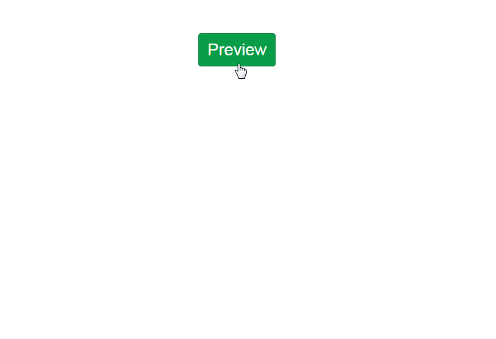

<h3 align="center">

shinyalert

</h3>

<h4 align="center">

Easily create pretty popup messages (modals) in Shiny   
<a href="https://daattali.com/shiny/shinyalert-demo/">Demo</a> ·
Copyright 2018 <a href="https://deanattali.com">Dean Attali</a>

</h4>

 

-----

`shinyalert` lets you easily create pretty popup messages (modals) in
Shiny.

A modal can contain text, images, OK/Cancel buttons, an input to get a
response from the user, and many more customizable options. The value of
the modal can be retrieved in Shiny using an input or using callback
functions. See the [demo Shiny
app](https://daattali.com/shiny/shinyalert-demo/) online for examples.

**If you find shinyalert useful, please consider supporting my efforts
developing open-source R packages\!**

# Table of contents

  - [Overview](#overview)
  - [Installation](#install)
  - [Input modals](#input-modals)
  - [Callbacks and return values](#callbacks)
  - [Contributions](#contributions)

<h2 id="overview">

Overview

</h2>

`shinyalert` uses the [sweetalert](https://github.com/t4t5/sweetalert)
JavaScript library to create simple and elegant popups (modals) in
Shiny.

Simply call `shinyalert()` with the desired parameters, such as a title
and text, and a modal will show up (don't worry, there are many other
parameters to customize the modal).

In order to be able to call `shinyalert()` in a Shiny app to create
modals, you must first call `useShinyalert()` anywhere in the app's UI.

Here is a basic modal created with `shinyalert`:

And the corresponding minimal Shiny app that creates this modal:

    library(shiny)
    library(shinyalert)
    
    ui <- fluidPage(
      useShinyalert(),  # Set up shinyalert
      actionButton("preview", "Preview")
    )
    
    server <- function(input, output, session) {
      observeEvent(input$preview, {
        # Show a modal when the button is pressed
        shinyalert("Oops!", "Something went wrong.", type = "error")
      })
    }
    
    shinyApp(ui, server)

It's also possible to ask the user to enter input in a modal.

The modal can also have a "Cancel" button, as well as many other
customizable options.

<h2 id="install">

Installation

</h2>

To install the stable CRAN version:

    install.packages("shinyalert")

To install the latest development version from GitHub:

    install.packages("devtools")
    devtools::install_github("daattali/shinyalert")

<h2 id="input-modals">

Input modals

</h2>

Usually the purpose of a modal is simply informative, to show some
information to the user. However, the modal can also be used to retrieve
an input from the user by setting the `type = "input"` parameter.

Only a single input can be used inside a modal. By default, the input
will be a text input, but you can use other HTML input types by
specifying the `inputType` parameter. For example, `inputType =
"number"` will provide the user with a numeric input in the modal.

See the [Callbacks and return values](#callbacks) section below for
information on how to access the value entered by the user.

<h2 id="callbacks">

Callbacks and return values

</h2>

Modals created with `shinyalert` have a return value when they close.

When there is an input field in the modal (`type="input"`), the value of
the modal is the value the user entered. When there is no input field in
the modal, the value of the modal is `TRUE` if the user clicked the "OK"
button, and `FALSE` if the user clicked the "Cancel" button.

When the user exits the modal using the Escape key or by clicking
outside of the modal, the return value is `FALSE`. If the `timer`
parameter is used and the modal closes automatically as a result of the
timer, no value is returned from the modal.

The return value of the modal can be accessed via `input$shinyalert` in
the Shiny server's code, as if it were a regular Shiny input. The return
value of the modal is also passed as an argument to the `callbackR` and
`callbackJS` functions if they are provided.

For example, using the following code will result in a modal containing
an input field, and after the user clicks "OK", a hello message will be
printed to both the R console and in a native JavaScript alert box.

    shinyalert(
      "Enter your name", type = "input",
      callbackR = function(x) { message("Hello ", x) },
      callbackJS = "function(x) { alert('Hello ' + x); }"
    )

Notice that the `callbackR` function accepts R code, while the
`callbackJS` function uses JavaScript code.

Since closing the modal with the Escape key results in a return value of
`FALSE`, the callback functions can be modified to not print hello in
that case.

    shinyalert(
      "Enter your name", type = "input",
      callbackR = function(x) { if(x != FALSE) message("Hello ", x) },
      callbackJS = "function(x) { if (x !== false) { alert('Hello ' + x); } }"
    )

<h2 id="shiny-comparison">

Comparison with Shiny modals

</h2>

only one input, less flexible, simpler and prettier. callbacks, timer

<h2 id="contributions">

Contributions

</h2>

If you have any suggestions or feedback, I would love to hear about it.
You can either [message me directly](https://deanattali.com/contact),
[open an issue](https://github.com/daattali/shinyjs/issues) if you want
to request a feature/report a bug, or make a pull request if you can
contribute.

Lastly, if you find shinyalert useful, please consider [supporting
me](https://www.paypal.me/daattali/20) for the countless hours I've
spent building, documenting, and supporting various open-source packages
:)
